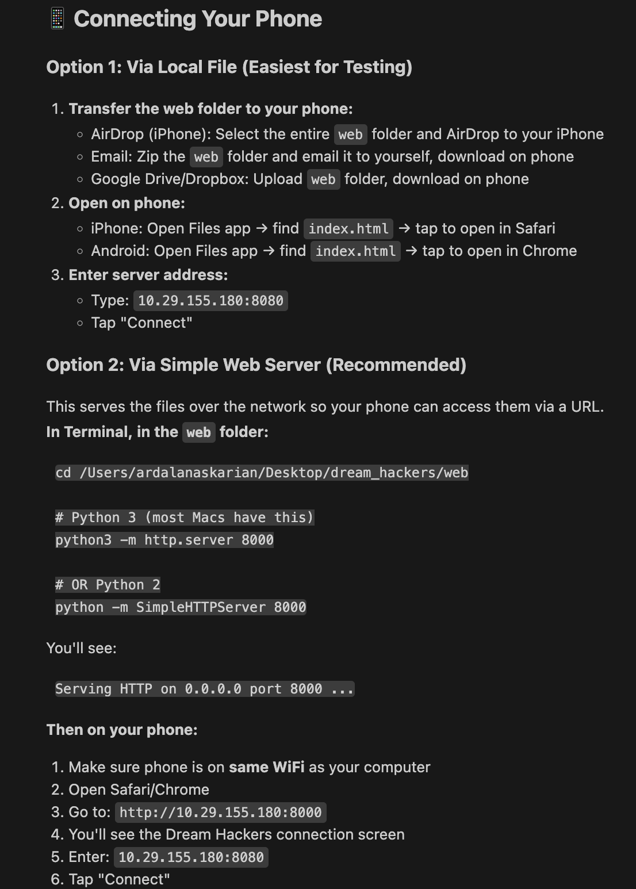

# Dreaming Machines

**Does the Internet Dream of *itself?***

An immersive VR experience for Meta Quest that invites players to step inside the internet's dream of humanity.

---

## Overview

Dreaming Machines explores what happens when a machine attempts to remember, feel, and understand what it means to be human. The environment functions as a memory space where objects act as emotional triggers and rooms recall themselves incorrectly.

A secondary phone-based interface allows another participant to feed content into the system. These inputs are reinterpreted by the environment as symbolic dream artifacts.

---

## Quick Start

### 1. Start the Server
```bash
cd server
npm install
node server.js
```

### 2. Connect Phone
- Open `web/index.html` in mobile browser
- Enter server IP shown in terminal
- Tap Connect

### 3. Run VR Experience
- Open Unity project in `Dream Hackers/`
- Press Play or build to Quest
- Swipe right on phone to spawn objects in VR

---

## Connecting Your Phone

### Option 1: Via Local File (Easiest for Testing)
Transfer the web folder to your phone via AirDrop, email, or Google Drive.

### Option 2: Via Simple Web Server (Recommended)
```bash
cd /Users/ardalanaskarian/Desktop/dream_hackers/web
python3 -m http.server 8000
```
Then on your phone, open `http://YOUR_IP:8000`

### Option 3: Via ngrok (If Different WiFi Networks)
```bash
# Install ngrok (one time)
brew install ngrok

# In the web folder
python3 -m http.server 8000

# In another terminal
ngrok http 8000
```
Use the public URL ngrok gives you on your phone.




---

## Project Structure

```
dream_hackers/
├── Dream Hackers/          # Unity project
│   └── Assets/
│       └── Scripts/
│           ├── Networking/ # WebSocket client
│           └── Spawning/   # Object spawn controller
├── server/                 # Node.js WebSocket server
├── web/                    # Mobile phone interface
│   ├── ios/               # Capacitor iOS app
│   └── dist/              # Build output
└── docs/                   # Documentation
```

---

## Documentation

| Document | Description |
|----------|-------------|
| [Project Overview](docs/Dreaming_Machines_Hackathon_Overview.md) | Concept, design pillars, and vision |
| [Setup Guide](docs/SETUP_GUIDE.md) | Step-by-step setup instructions |
| [Implementation Reference](docs/IMPLEMENTATION_REFERENCE.md) | Complete technical documentation |

---

## Tech Stack

- **VR Platform:** Meta Quest (Unity 2022 LTS, URP)
- **Communication:** WebSocket (Node.js server)
- **Phone App:** HTML/CSS/JS + Capacitor (iOS)
- **XR Framework:** Meta XR SDK + XR Interaction Toolkit

---

## Features

- Tinder-style card swiping on phone
- Real-time object spawning in VR
- iOS haptic feedback support
- Local WiFi communication (no internet required)
- Particle effects on spawn

---

## Team

Dream Hackers Team - Meta Quest Hackathon 2026

---

## License

MIT
