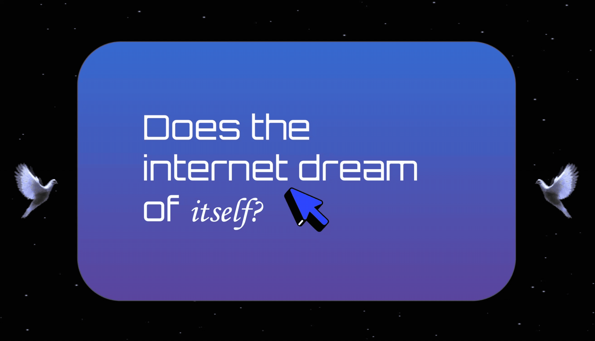
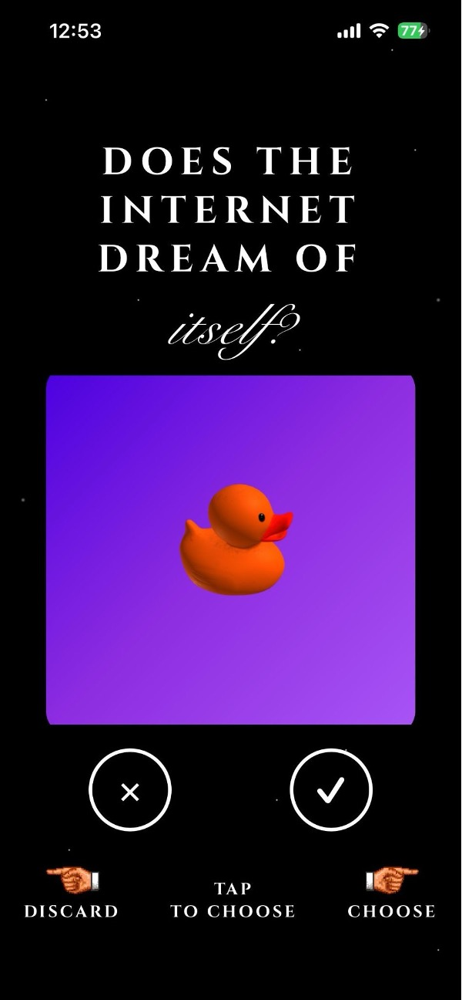
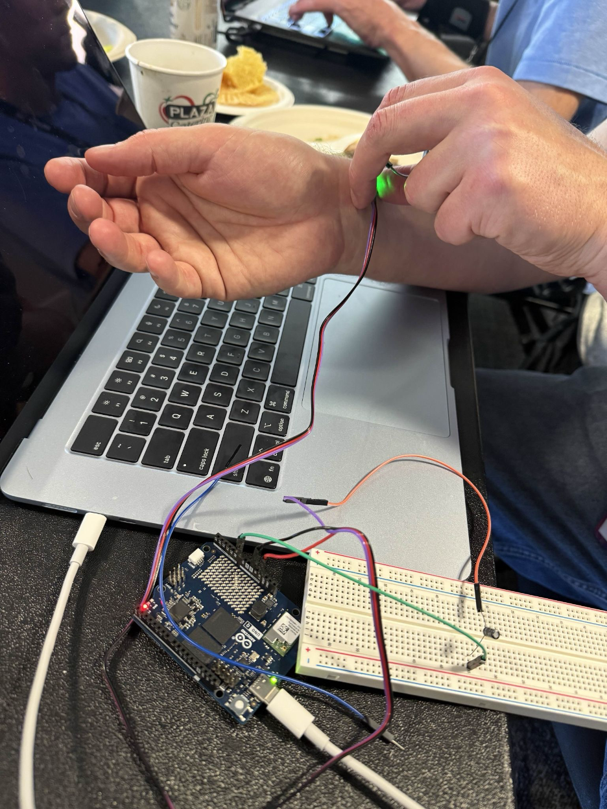
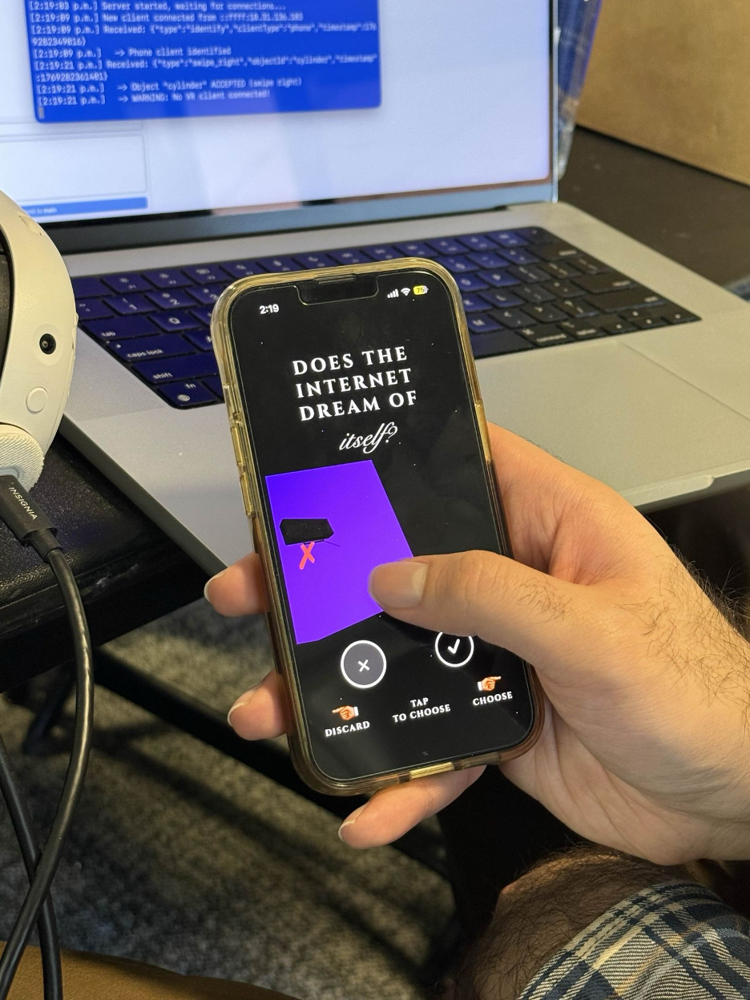
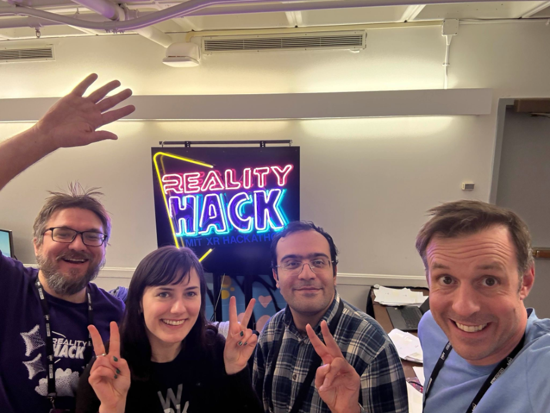

<div align="center">



**An immersive VR experience for Meta Quest where players step inside the internet's dream of humanity.**

<br>

<a href="https://www.youtube.com/watch?v=NY5WnzpsTtc"></a>
&nbsp;&nbsp;
<a href="https://youtu.be/Sq_jPCJJbIw"></a>
&nbsp;&nbsp;
<a href="https://docs.google.com/presentation/d/1j2qTOKgDBow35dwZyvudL7hVXUyHlVYta0Yu95tXGPk/edit?usp=sharing"></a>

<br><br>


</div>


> *What would the internet dream about?*
>
> *An interconnected web of billions of people? The past, or the future?*
>
> In his documentary *Lo and Behold: Reveries of the Connected World*, Werner Herzog poses the question: **"Does the internet dream of itself?"**
>
> Technology is in the realm of the human. It is created by us, populated by us, and is an extension of us.
>
> ### *If the internet could dream, it would dream about us.*


##  &nbsp; The Interaction

In this experience, users scroll through a series of objects on their phone. By swiping, they **choose** or **discard** items—Tinder-style—feeding content into a shared dream space.

As they scroll, a pulse sensor on their wrist captures their **heartbeat BPM**, streaming their emotional state directly into the VR environment where it drives real-time shader effects.

<div align="center">
<table>
<tr>
<td align="center"><br><sub>Swipe Interface</sub></td>
<td align="center"><br><sub>Pulse Sensor Setup</sub></td>
<td align="center"><br><sub>Choose or Discard</sub></td>
</tr>
</table>
</div>

##  &nbsp; The Subconscious

The internet's subconscious rendered as a familiar interior—transformed by dream logic.

Everyday objects float weightlessly. Time slips through windows. Digital artifacts coexist with organic life. The space feels calm, yet undeniably alive.

<div align="center">

</div>

##  &nbsp; How It Works

```
                              ┌─────────────────┐
                              │                 │
    ┌─────────────┐           │   WebSocket     │           ┌─────────────┐
    │             │  swipes   │    Server       │  spawns   │             │
    │    Phone    │ ────────► │   (Node.js)     │ ────────► │  Meta Quest │
    │   Web App   │   WiFi    │   Port 8080     │   WiFi    │   Unity VR  │
    │             │           │                 │           │             │
    └─────────────┘           └────────┬────────┘           └─────────────┘
                                       │
                                       │ heartbeat
                              ┌────────┴────────┐
                              │                 │
                              │    Arduino      │
                              │  Pulse Sensor   │
                              │   TCP/WiFi      │
                              │                 │
                              └─────────────────┘
```

##  &nbsp; Features

<table>
<tr>
<td width="50%" valign="top">

| Experience | |
|:---|:---|
|  &nbsp; **Tinder-style swiping** | 3D previews |
|  &nbsp; **Real-time spawning** | Particle effects |
|  &nbsp; **Live heartbeat shaders** | Biometric data |
|  &nbsp; **XR interactable objects** | Room animations |
|  &nbsp; **Controller support** | Intuitive interaction |

</td>
<td width="50%" valign="top">

| Technical | |
|:---|:---|
|  &nbsp; **Local WiFi only** | No internet required |
|  &nbsp; **Arduino pulse sensor** | Biometric capture |
|  &nbsp; **iOS haptic feedback** | Vibration support |
|  &nbsp; **Custom URP shaders** | Dream effects |
|  &nbsp; **OpenXR + XRI Toolkit** | VR framework |

</td>
</tr>
</table>

##  &nbsp; Tech Stack

| Technology | Purpose |
|:---|:---|
|  | VR rendering & custom shaders |
|  | Standalone VR platform |
|  | Real-time communication hub |
|  | Phone app with 3D previews |
|  | Biometric data capture |
|  | Optimized asset format |

##  &nbsp; Quick Start

```bash
# ═══════════════════════════════════════════════════════════════
# 1. START THE SERVER
# ═══════════════════════════════════════════════════════════════
cd server && npm install && node server.js

# ═══════════════════════════════════════════════════════════════
# 2. CONNECT YOUR PHONE
# ═══════════════════════════════════════════════════════════════
# Open web/index.html on your phone
# Enter the server IP address
# Tap "Connect"

# ═══════════════════════════════════════════════════════════════
# 3. CONNECT HEARTBEAT SENSOR
# ═══════════════════════════════════════════════════════════════
# Upload pulse sensor sketch to Arduino
# Configure SingularityManager in Unity:
#   - Arduino IP address
#   - Port number
# Message format: "BPM: 72 | IBI: 832"

# ═══════════════════════════════════════════════════════════════
# 4. ENTER THE DREAM
# ═══════════════════════════════════════════════════════════════
# Open Unity project → Press Play (or build to Quest)
# Swipe right on phone → Objects materialize in VR
# Your heartbeat → Drives shader effects in real-time
```

<details>
<summary><b>Project Structure</b></summary>
<br>

```
dream_hackers/
│
├── Dream Hackers/                 # Unity VR Project
│   └── Assets/Scripts/
│       ├── Networking/            # WebSocket client
│       ├── Spawning/              # Object spawn controller
│       ├── MaterialFloatController.cs   # BPM → shader control
│       ├── PickupAnimatorTrigger.cs     # XR grab → animation
│       └── SingularityManager.cs        # Arduino WiFi connection
│
├── server/                        # Node.js WebSocket Server
│   └── server.js                  # Port 8080
│
├── web/                           # Phone Interface
│   ├── index.html                 # Swipe UI
│   ├── ios/                       # Capacitor iOS build
│   └── dist/                      # Production build
│
└── docs/                          # Documentation
    ├── design-vision.md           # Concept & artistic goals
    ├── getting-started.md         # Quick setup
    ├── setup-guide.md             # Detailed Unity config
    ├── architecture.md            # Technical reference
    ├── unity-events-api.md        # Event system docs
    └── exporting-3d-models.md     # GLB export guide
```

</details>

<details>
<summary><b>Documentation</b></summary>
<br>

| Document | Description |
|:---|:---|
| [Design Vision](docs/design-vision.md) | Project concept, design pillars, artistic goals |
| [Getting Started](docs/getting-started.md) | Quick setup and connection guide |
| [Setup Guide](docs/setup-guide.md) | Detailed Unity configuration & Quest build |
| [Architecture](docs/architecture.md) | Technical reference & message protocols |
| [Unity Events API](docs/unity-events-api.md) | Event system for custom scripts |
| [Exporting 3D Models](docs/exporting-3d-models.md) | GLB export workflow |

</details>

##  &nbsp; Team

<table>
<tr>
<td width="45%">

</td>
<td width="55%" valign="top">

### Dream Hackers

| Name | Role |
|:---|:---|
| **Samantha Herle** | Designer & PM |
| **Sean Rove** | Tech Art |
| **Ardalan Askarian** | Software |
| **Ben Branch** | Hardware |

*Built with love at* 

</td>
</tr>
</table>

<div align="center">


<br>


<br>


<sub>If the internet could dream, it would dream about us.</sub>

</div>
